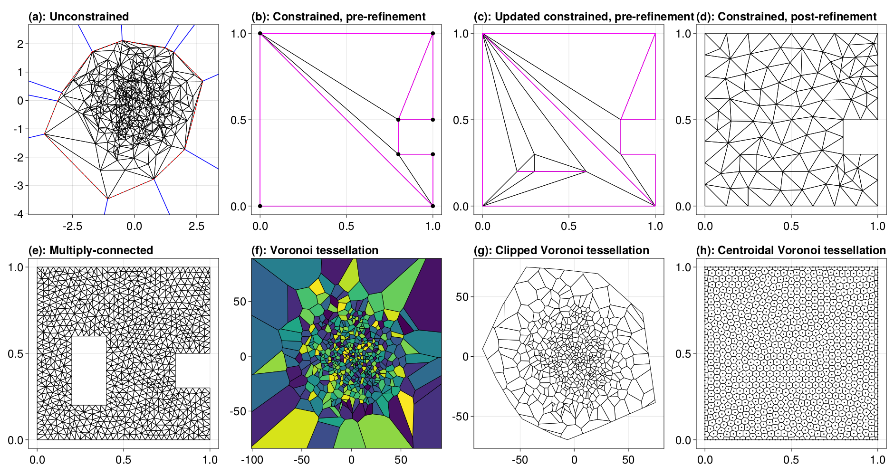

# DelaunayTriangulation

[](https://DanielVandH.github.io/DelaunayTriangulation.jl/stable/)
[](https://DanielVandH.github.io/DelaunayTriangulation.jl/dev/)
[](https://codecov.io/gh/DanielVandH/DelaunayTriangulation.jl)
[](https://zenodo.org/badge/latestdoi/540660309)

This is a package for computing Delaunay triangulations and Voronoi tessellations of points in two dimensions, amongst many other features:

- Unconstrained and constrained Delaunay triangulations, supporting many types of domains.
- Computation of Voronoi tessellations, clipped Voronoi tessellations where the Voronoi tiles get clipped to the convex hull, and centroidal Voronoi tessellations where each Voronoi tile's generator is the tile's centroid.
- Mesh refinement, with support for custom angle and area constraints.
- Dynamic point insertion, point deletion, and segment insertion, amongst many other operations.
- Computation of convex hulls.
- Triangulation of convex polygons.
- Point location.
- Computation of the pole of inaccessibility.
- The interface for defining geometric primitives is fully customisable.

To ensure that the algorithms are robust, we use [ExactPredicates.jl](https://github.com/lairez/ExactPredicates.jl) to define all geometric predicates in this package. Much of the work in this package is derived from the book *Delaunay Mesh Generation* by Cheng, Dey, and Shewchuk (2013). Please see the documentation for much more information.

Some examples are below (and in the documentation), but if you would also like to see how DelaunayTriangulation.jl is used in other packages, see [FiniteVolumeMethod.jl](https://github.com/DanielVandH/FiniteVolumeMethod.jl) (solving 2D PDEs) and [NaturalNeighbours.jl](https://github.com/DanielVandH/NaturalNeighbours.jl) (scattered data interpolation).

## Quick Example 

See the documentation for plenty of examples. For now, here are some small examples.

```julia
using DelaunayTriangulation, CairoMakie, StableRNGs

fig = Figure(fontsize=24)

## Unconstrained example: Just some random points 
rng = StableRNG(2)
pts = randn(rng, 2, 500)
tri = triangulate(pts; rng)
ax = Axis(fig[1, 1], title="(a): Unconstrained", titlealign=:left, width=400, height=400)
triplot!(ax, tri, show_convex_hull=true, show_ghost_edges=true)

## Constrained example: Generate some points, convert to indices, triangulate 
points = [(0.0, 0.0), (1.0, 0.0), (1.0, 0.3), (0.8, 0.3),
    (0.8, 0.5), (1.0, 0.5), (1.0, 1.0), (0.0, 1.0), (0.0, 0.0)]
boundary_nodes, points = convert_boundary_points_to_indices(points)
edges = Set(((2, 8), (5, 7)))
tri = triangulate(points; boundary_nodes, edges)
ax = Axis(fig[1, 2], title="(b): Constrained, pre-refinement", titlealign=:left, width=400, height=400)
triplot!(ax, tri, show_points=true, show_constrained_edges=true)

## Dynamic updating 
n = num_points(tri)
add_point!(tri, (0.2, 0.2); rng)
add_point!(tri, (0.8, 0.8); rng)
add_point!(tri, (0.3, 0.2); rng)
add_point!(tri, (0.6, 0.2); rng)
add_point!(tri, (0.3, 0.3); rng)
add_edge!(tri, (n + 1, n + 4); rng)
delete_point!(tri, n + 2; rng)
ax = Axis(fig[1, 3], title="(c): Updated constrained, pre-refinement", titlealign=:left, width=400, height=400)
triplot!(ax, tri, show_constrained_edges=true)

## Refinement example
A = get_total_area(tri)
refine!(tri; max_area=1e-2A, min_angle=28.7, rng)
ax = Axis(fig[1, 4], title="(d): Constrained, post-refinement", titlealign=:left, width=400, height=400)
triplot!(ax, tri)

## Constrained example with holes
outer_boundary = [[(0.0, 0.0), (1.0, 0.0), (1.0, 0.3), (0.8, 0.3),
    (0.8, 0.5), (1.0, 0.5), (1.0, 1.0), (0.0, 1.0), (0.0, 0.0)]]
inner_boundary = [[(0.2, 0.2), (0.2, 0.6), (0.4, 0.6), (0.4, 0.2), (0.2, 0.2)]]
boundary_nodes, points = convert_boundary_points_to_indices([outer_boundary, inner_boundary])
edges = Set(((2, 8), (5, 7)))
tri = triangulate(points; boundary_nodes, edges, rng)
A = get_total_area(tri)
refine!(tri; max_area=1e-3A, min_angle=31.5, rng)
ax = Axis(fig[2, 1], title="(e): Multiply-connected", titlealign=:left, width=400, height=400)
triplot!(ax, tri)

## Voronoi tessellation: Make tessellations from their dual triangulation
pts = 25randn(rng, 2, 500)
tri = triangulate(pts; rng)
vorn = voronoi(tri)
ax = Axis(fig[2, 2], title="(f): Voronoi tessellation", titlealign=:left, width=400, height=400)
voronoiplot!(ax, vorn, show_generators=false)
xlims!(ax, -120, 120)
ylims!(ax, -120, 120)

## Clipped Voronoi tessellation 
vorn = voronoi(tri, true)
ax = Axis(fig[2, 3], title="(g): Clipped Voronoi tessellation", titlealign=:left, width=400, height=400)
voronoiplot!(ax, vorn, show_generators=false, color=:white)

## Centroidal Voronoi tessellation (CVT)
points = [(0.0, 0.0), (1.0, 0.0), (1.0, 1.0), (0.0, 1.0)]
tri = triangulate(points; boundary_nodes=[1, 2, 3, 4, 1], rng)
refine!(tri; max_area=1e-3, min_angle=29.871, rng)
vorn = voronoi(tri)
smooth_vorn = centroidal_smooth(vorn; maxiters=2500, rng)
ax = Axis(fig[2, 4], title="(h): Centroidal Voronoi tessellation", titlealign=:left, width=400, height=400)
voronoiplot!(ax, smooth_vorn, show_generators=true, markersize=4, colormap=:jet)

resize_to_layout!(fig)
fig
```

