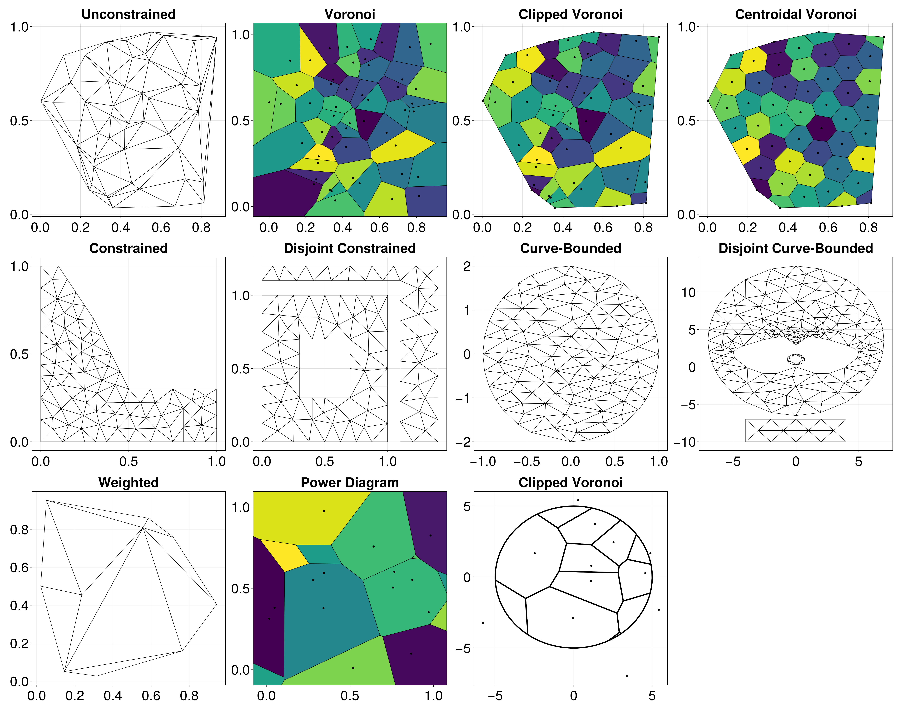

# DelaunayTriangulation

[](https://JuliaGeometry.github.io/DelaunayTriangulation.jl/stable/)
[](https://JuliaGeometry.github.io/DelaunayTriangulation.jl/dev/)
[](https://codecov.io/gh/JuliaGeometry/DelaunayTriangulation.jl)
[](https://zenodo.org/badge/latestdoi/540660309)
[](https://github.com/JuliaTesting/Aqua.jl)

This is a package for constructing Delaunay triangulations and Voronoi tessellations of planar point sets. Supports unconstrained and constrained triangulations, mesh refinement, triangulation of curve bounded domains, Voronoi tessellations, and clipped and centroidal Voronoi tessellations. All geometric predicates are computed via [ExactPredicates.jl](https://github.com/lairez/ExactPredicates.jl). To install the package, do

```julia
julia>] add DelaunayTriangulation
```

Many features are available, some of these being:

- Unconstrained and constrained Delaunay triangulations, supporting many types of domains.
- Computation of Voronoi tessellations, clipped Voronoi tessellations where the Voronoi tiles get clipped to the convex hull, and centroidal Voronoi tessellations where each Voronoi tile's generator is the tile's centroid.
- Mesh refinement, with support for custom angle and area constraints, as well as refinement of curve-bounded domains.
- Dynamic point insertion, point deletion, and segment insertion, amongst many other operations.
- Computation of convex hulls.
- Triangulation of convex polygons.
- Point location.
- Computation of the pole of inaccessibility.
- The interface for defining geometric primitives is fully customisable.

To ensure that the algorithms are robust, we use [ExactPredicates.jl](https://github.com/lairez/ExactPredicates.jl) to define all geometric predicates in this package. Much of the work in this package is derived from the book *Delaunay Mesh Generation* by Cheng, Dey, and Shewchuk (2013). Please see the documentation for much more information.

Some examples are below (and in the documentation), but if you would also like to see how DelaunayTriangulation.jl is used in other packages, see [FiniteVolumeMethod.jl](https://github.com/SciML/FiniteVolumeMethod.jl) (solving 2D PDEs) and [NaturalNeighbours.jl](https://github.com/DanielVandH/NaturalNeighbours.jl) (scattered data interpolation).

## Example Usage 
Here is a quick example of some ways the package can be used. As mentioned, see the docs for many examples.

```julia
# using Pkg; Pkg.add(["DelaunayTriangulation", "CairoMakie"])
using DelaunayTriangulation, CairoMakie

# Unconstrained 
points = rand(2, 50)
tri1 = triangulate(points)

# Voronoi example 
vorn2 = voronoi(tri1)

# Clipped Voronoi 
vorn3 = voronoi(tri1, clip=true)

# Smoothed Voronoi 
vorn4 = centroidal_smooth(vorn3)

# Constrained example with refinement 
boundary_points = [(0.0, 0.0), (1.0, 0.0), (1.0, 0.3), (0.5, 0.3),
    (0.3, 0.7), (0.1, 1.0), (0.0, 1.0), (0.0, 0.0)]
boundary_nodes, points = convert_boundary_points_to_indices(boundary_points)
tri5 = triangulate(points; boundary_nodes)
refine!(tri5; max_area=1e-2get_area(tri5))

# Disjoint constrained example with refinement 
boundary_points = [
    [[(0.0, 0.0), (1.0, 0.0), (1.0, 1.0), (0.0, 1.0), (0.0, 0.0)]],
    [[(0.3, 0.3), (0.3, 0.7), (0.7, 0.7), (0.7, 0.3), (0.3, 0.3)]],
    [[(1.2, 0.0), (1.4, 0.0), (1.4, 1.2), (0.0, 1.2), (0.0, 1.1),
        (1.1, 1.1), (1.1, 0.0), (1.2, 0.0)]]
]
boundary_nodes, points = convert_boundary_points_to_indices(boundary_points)
tri6 = triangulate(points; boundary_nodes)
refine!(tri6; max_area=1e-2get_area(tri6))

# Curve-bounded example
using DelaunayTriangulation: EllipticalArc
ellipse = EllipticalArc((1.0, 0.0), (1.0, 0.0), (0.0, 0.0), 1.0, 2.0, 0.0)
tri7 = triangulate(NTuple{2,Float64}[]; boundary_nodes=[ellipse])
refine!(tri7; max_area=1e-2get_area(tri7))

# Disjoint curve-bounded example 
ellipse = EllipticalArc((7.0, 3.5), (7.0, 3.5), (0.0, 3.5), 7.0, 10.0, 0.0)
catmull_cp = [(0.0, 0.0), (-2.0, -1.0), (-4.0, 0.0), (-5.0, 2.0), (-1.0, 4.0), (0.0, 3.0),
    (1.0, 4.0), (5.0, 2.0), (4.0, 0.0), (2.0, -1.0), (0.0, 0.0)]
catmull_spl = CatmullRomSpline(catmull_cp)
circle = CircularArc((0.5, 1.5), (0.5, 1.5), (0.0, 1.0))
circle2 = CircularArc((0.1, 1.5), (0.1, 1.5), (0.0, 1.0), positive=false)
points = [(-4.0, -10.0), (4.0, -10.0), (4.0, -7.0), (-4.0, -7.0)]
square = [1, 2, 3, 4, 1]
boundary_nodes = [[square], [[ellipse]], [[catmull_spl]], [[circle]], [[circle2]]]
tri8 = triangulate(points; boundary_nodes)
refine!(tri8; max_area=1e-2get_area(tri8)) # could also use find_polygon to help define a custom refinement function for each shape

# Plotting 
fig = Figure(fontsize = 42, size = (2800, 1480))
ax = Axis(fig[1, 1], title="Unconstrained", width=600,height=600);            triplot!(ax, tri1)
ax = Axis(fig[1, 2], title="Voronoi", width=600,height=600);                  voronoiplot!(ax, vorn2)
ax = Axis(fig[1, 3], title="Clipped Voronoi", width=600,height=600);          voronoiplot!(ax, vorn3)
ax = Axis(fig[1, 4], title="Centroidal Voronoi", width=600,height=600);       voronoiplot!(ax, vorn4)
ax = Axis(fig[2, 1], title="Constrained", width=600,height=600);              triplot!(ax, tri5)
ax = Axis(fig[2, 2], title="Disjoint Constrained", width=600,height=600);     triplot!(ax, tri6)
ax = Axis(fig[2, 3], title="Curve-Bounded", width=600,height=600);            triplot!(ax, tri7)
ax = Axis(fig[2, 4], title="Disjoint Curve-Bounded", width=600,height=600);   triplot!(ax, tri8)
```



## Contributing

Contributions are very welcome. If you encounter any issues or would like to make any feature requests and suggestions, you are encouraged to open an issue - any bug reports should be accompanied by a minimal example that reproduces your bug. You are also highly encouraged to make simple pull requests fixing any grammar or spelling issues you see in the documentation, or fixing any unclear explanations (or make an issue raising your concern instead if you prefer).

The issues tab also lists features that would be nice to have in the package. If you would like to contribute towards any of those features, or towards any other significant enhancements, you are recommended to first post on that issue about your ideas before committing towards a complete implementation. 

If you want to use a function from the package that isn't public (meaning it is not listed in the API section of the documentation), you are welcome to make an issue proposing that it be made public, mentioning your need for it.

### Writing a Pull Request 

When contributing in the form of a pull request, there are a few important features that should be present, listed below. The point of these requirements is not to make you concerned about the amount of work needed to fulfill them, but to ensure that your contribution can be accepted more readily without the reviewer and yourself needing to go back-and-forth to meet the package's standards. If you do not meet them, you may still be fine depending on what you are contributing. You can always ask for help.

1. **You should outline what your pull request does in the description**. You should also link back to an associated issue if applicable.
2. **Document any new functions**. If your contribution involves any new functions, make sure they are well documented even if they are only for internal use.
3. **You need to include appropriate tests for your contribution**. For small changes, simple tests are fine, but for larger changes that implement or change an algorithm, understanding what tests you need to write is crucial when you are implementing a new feature. For example, if you wanted to implement a new algorithm for inserting a curve into a triangulation, you need to make sure that you test things like (1) point sets in general position, (2) point sets with many cocircular points, (3) collinear edges, and so on. In particular, degeneracies are some of the most important things to test for. This is not simple to do if you are inexperienced, so do feel free to ask for guidance.
4. **Your contribution should only do one thing**. To make sure that it is easy to track your changes, and to make it easier to track regressions across versions, please try to only make your contribution do one thing. For example, do not move around a bunch of files while at the same time implementing a function somewhere else - make two pull requests.
5. **Add to NEWS.md**. Describe your change in the NEWS.md file.

If you are just contributing something minimal, for example a typo, even a blank PR description is fine so long as it is obvious what you have done.

## Similar Packages

This is not the only Delaunay triangulation package available. Some others are:

- [VoronoiDelaunay.jl](https://github.com/JuliaGeometry/VoronoiDelaunay.jl): A pure Julia library that constructs planar triangulations and tessellations like in this package, although no support for constrained triangulations / mesh refinement or clipped / centroid tessellations. Restricts points to $[1, 2] \times [1, 2]$.
- [VoronoiCells.jl](https://github.com/JuliaGeometry/VoronoiCells.jl): A pure Julia library that extends VoronoiDelaunay.jl. This package provides useful tools for constructing and working with Voronoi tessellations. Supports clipping Voronoi cells to a specified rectangle. Like VoronoiDelaunay.jl, restricts points to $[1, 2] \times [1, 2]$.
- [Delaunay.jl](https://github.com/eschnett/Delaunay.jl): Wraps Python's main Delaunay triangulation library, [`scipy.spatial.Delaunay`](https://docs.scipy.org/doc/scipy/reference/generated/scipy.spatial.Delaunay.html), for computing Delaunay triangulations in $\mathbb R^N$. I don't believe constrained triangulations or mesh refinement is available here.
- [MiniQhull.jl](https://github.com/gridap/MiniQhull.jl): Wraps [Qhull](http://www.qhull.org/) for computing unconstrained Delaunay triangulations in $\mathbb R^N$. No support is provided for mesh refinement.
- [DirectQhull.jl](https://github.com/JuhaHeiskala/DirectQhull.jl/): Similar to MiniQhull.jl, although also provides support for convex hulls and Voronoi tessellations from Qhull.
- [Delaunator.jl](https://github.com/JuliaGeometry/Delaunator.jl): A pure Julia library modelled after the [JavaScript Delaunator library](https://github.com/mapbox/delaunator). This package can construct unconstrained triangulations of planar point sets. No support is available for constrained triangulations or mesh refinement, although support exists for computing the dual Voronoi tessellation. Centroidal tessellations are not implemented, although the Voronoi cells can be clipped to a bounding box. 
- [TriangleMesh.jl](https://github.com/konsim83/TriangleMesh.jl), [Triangulate.jl](https://github.com/JuliaGeometry/Triangulate.jl), [Triangle.jl](https://github.com/cvdlab/Triangle.jl): Interfaces to [Shewchuk's Triangle library](https://www.cs.cmu.edu/~quake/triangle.html).
- [TetGen.jl](https://github.com/JuliaGeometry/TetGen.jl): This is for Delaunay tetrahedralisation, wrapping [TetGen](https://wias-berlin.de/software/index.jsp?id=TetGen).
- [GMT.jl](https://github.com/GenericMappingTools/GMT.jl): A wrapper of [GMT](https://github.com/GenericMappingTools/gmt), allowing for [unconstrained Delaunay triangulations in two dimensions](https://www.generic-mapping-tools.org/GMTjl_doc/documentation/modules/triangulate/index.html#triangulate), and for [spherical triangulation, i.e. triangulation of points lying on a sphere](https://www.generic-mapping-tools.org/GMTjl_doc/documentation/modules/sphtriangulate/index.html#sphtriangulate).

