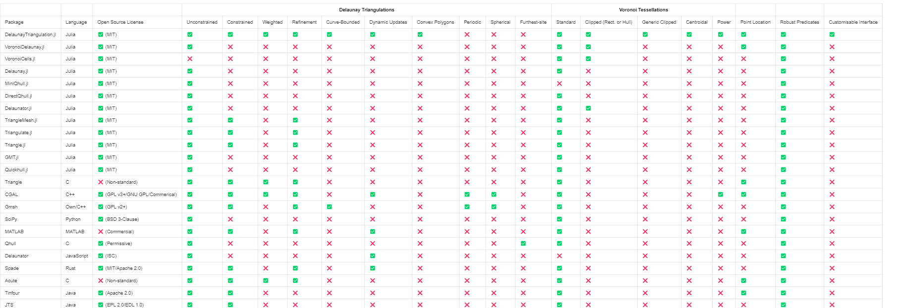

```@meta
CurrentModule = DelaunayTriangulation
```

# Introduction 

This is the documentation for DelaunayTriangulation.jl. [Click here to go back to the GitHub repository](https://github.com/JuliaGeometry/DelaunayTriangulation.jl).

This is a package for computing Delaunay triangulations and Voronoi tessellations of points in two dimensions, amongst many other features:

- Unconstrained and constrained Delaunay triangulations, supporting many types of domains.
- Weighted Delaunay triangulations.
- Computation of Voronoi tessellations, clipped Voronoi tessellations where the Voronoi tiles get clipped to a convex polygon, and centroidal Voronoi tessellations where each Voronoi tile's generator is the tile's centroid.
- Power diagrams.
- Mesh refinement, with support for custom angle and area constraints, as well as refinement of curve-bounded domains.
- Dynamic point insertion, point deletion, and segment insertion, amongst many other operations.
- Computation of convex hulls.
- Triangulation of convex polygons.
- Point location.
- Computation of the pole of inaccessibility.
- The interface for defining geometric primitives is fully customisable.

To ensure that the algorithms are robust, by default we make use of [AdaptivePredicates.jl](https://github.com/JuliaGeometry/AdaptivePredicates.jl) to use 
adaptive arithmetic for all geometric predicates in this package. This choice can be configured, allowing for the additional choices of [ExactPredicates.jl](https://github.com/lairez/ExactPredicates.jl) or no adaptive or exact arithmetic at all; see [here](manual/predicate_kernels.md). Much of the work in this package is derived from the book [*Delaunay Mesh Generation* by Cheng, Dey, and Shewchuk (2013)](https://people.eecs.berkeley.edu/~jrs/meshbook.html).

# Documentation Structure 

The documentation for this package is broken into several sections.

- **Tutorials**: These are examples that introduce the functionality of the package, demonstrating how to perform many operations. 
- **Manual**: Some particular descriptions of how certain things work in the package, such as representing boundaries and working with the triangulation and tessellation data structures. 
- **API Reference**: This section lists docstrings for all functions in the public API.
- **Extended Reference**: This section is for providing more details about the internals of the package, meaning not in the public API.The material in this section is subject to change across any version, but may be useful for you to understand how certain functions work. For example, all utility functions are documented here.
- **Mathematical Details**: This section is for describing in detail the mathematics that underpins the algorithms in this package, for example walking you through the theory behind the algorithm for computing constrained Delaunay triangulations. 
- **Example Applications**: In case you want to use this package for some of your applications, it might be useful to see how it has been applied in certain situations. Only a few applications are considered here, but more could be added in the future.
- **Terminology**: This section provides a short description of some of the terminology used throughout the package.

If you see anything missing in any of these sections, or anything you think could be improved, feel free to file an issue.

# Citing DelaunayTriangulation.jl

If you use DelaunayTriangulation.jl, please cite it. For now, we have a Zenodo record available at [10.5281/zenodo.7456989](https://doi.org/10.5281/zenodo.7456989).

# Installation

You can install DelaunayTriangulation.jl using the package manager:

```julia
import Pkg 
Pkg.add("DelaunayTriangulation")
```

Alternatively, the Pkg REPL can be used (accessed by typing `]` at the `julia>` prompt):

```julia
pkg> add DelaunayTriangulation
```

# License 

DelaunayTriangulation.jl is provided under a [MIT license](https://github.com/JuliaGeometry/DelaunayTriangulation.jl/blob/main/LICENSE).

# Similar Packages

This is not the only Delaunay triangulation package available. Some others are:

- [VoronoiDelaunay.jl](https://github.com/JuliaGeometry/VoronoiDelaunay.jl): A pure Julia library that constructs planar triangulations and tessellations like in this package, although no support for constrained triangulations / mesh refinement or clipped / centroid tessellations. Restricts points to $[1, 2] \times [1, 2]$.
- [VoronoiCells.jl](https://github.com/JuliaGeometry/VoronoiCells.jl): A pure Julia library that extends VoronoiDelaunay.jl. This package provides useful tools for constructing and working with Voronoi tessellations. Supports clipping Voronoi cells to a specified rectangle. Like VoronoiDelaunay.jl, restricts points to $[1, 2] \times [1, 2]$.
- [Delaunay.jl](https://github.com/eschnett/Delaunay.jl): Wraps Python's main Delaunay triangulation library, [`scipy.spatial.Delaunay`](https://docs.scipy.org/doc/scipy/reference/generated/scipy.spatial.Delaunay.html), for computing Delaunay triangulations in $\mathbb R^N$. I don't believe constrained triangulations or mesh refinement is available here.
- [MiniQhull.jl](https://github.com/gridap/MiniQhull.jl): Wraps [Qhull](http://www.qhull.org/) for computing unconstrained Delaunay triangulations in $\mathbb R^N$. No support is provided for mesh refinement.
- [DirectQhull.jl](https://github.com/JuhaHeiskala/DirectQhull.jl/): Similar to MiniQhull.jl, although also provides support for convex hulls and Voronoi tessellations from Qhull.
- [Delaunator.jl](https://github.com/JuliaGeometry/Delaunator.jl): A pure Julia library modelled after the [JavaScript Delaunator library](https://github.com/mapbox/delaunator). This package can construct unconstrained triangulations of planar point sets. No support is available for constrained triangulations or mesh refinement, although support exists for computing the dual Voronoi tessellation. Centroidal tessellations are not implemented, although the Voronoi cells can be clipped to a bounding box. 
- [TriangleMesh.jl](https://github.com/konsim83/TriangleMesh.jl), [Triangulate.jl](https://github.com/JuliaGeometry/Triangulate.jl), [Triangle.jl](https://github.com/cvdlab/Triangle.jl): Interfaces to [Shewchuk's Triangle library](https://www.cs.cmu.edu/~quake/triangle.html).
- [TetGen.jl](https://github.com/JuliaGeometry/TetGen.jl): This is for Delaunay tetrahedralisation, wrapping [TetGen](https://wias-berlin.de/software/index.jsp?id=TetGen).
- [GMT.jl](https://github.com/GenericMappingTools/GMT.jl): A wrapper of [GMT](https://github.com/GenericMappingTools/gmt), allowing for [unconstrained Delaunay triangulations in two dimensions](https://www.generic-mapping-tools.org/GMTjl_doc/documentation/modules/triangulate/index.html#triangulate), and for [spherical triangulation, i.e. triangulation of points lying on a sphere](https://www.generic-mapping-tools.org/GMTjl_doc/documentation/modules/sphtriangulate/index.html#sphtriangulate).
- [Quickhull.jl](https://github.com/augustt198/Quickhull.jl): A pure Julia library for unconstrained triangulations, Voronoi tessellations, and convex hulls in $N$ dimensions.

In addition to these Julia packages, software packages in other programming languages are available, such as:

- [Triangle](https://www.cs.cmu.edu/~quake/triangle.html): A C library for generating (constrained) Delaunay triangulations, Voronoi tessellations, and refined meshes. Also supports weighted triangulations. As mentioned above, there is a Julia interface to this library through TriangleMesh.jl, Triangulate.jl, or Triangle.jl. 
- [CGAL](https://www.cgal.org/): A C++ library which, among many other features relevant in computational geometry, supports Delaunay triangulations, spherical triangulations, periodic triangulations, constrained triangulations, 3D Delaunay triangulations, Voronoi tessellations, mesh refinement, surface triangulations, and more.
- [Gmsh](https://gmsh.info/): Gmsh is a finite element mesh generator with many features, providing constrained Delaunay triangulations (or, in addition to triangles, elements can also be mixed with e.g. squares) and mesh refinement with many options. Provides a set of meshing algorithms to choose from. Supports both 2D and 3D meshing. In addition to simple segments, you can also provide curves for boundaries and surfaces in the 3D case. Has interfaces in several languages, including [Gmsh.jl](https://github.com/JuliaFEM/Gmsh.jl).
- [SciPy](https://docs.scipy.org/doc/scipy/tutorial/spatial.html): A Python library providing Delaunay triangulations, Voronoi tessellations, and convex hulls in $\mathbb R^N$. Does not support constrained triangulations or mesh refinement.
- [MATLAB](https://uk.mathworks.com/help/matlab/computational-geometry.html?s_tid=CRUX_lftnav): MATLAB has built-in functions for Delaunay triangulations and Voronoi tessellations in two and three dimensions. Additionally, it supports constrained triangulations and mesh refinement.
- [Qhull](http://www.qhull.org/): A C library for computing Delaunay triangulations, Voronoi tessellations, and convex hulls in $\mathbb R^N$. No support is provided for constrained triangulations or mesh refinement, but it does provide furthest-site Delaunay triangulations and furthest-site Voronoi tessellations. The packages MiniQhull.jl and DirectQhull.jl wrap Qhull for use in Julia.
- [Delaunator](https://github.com/mapbox/delaunator): A JavaScript library that provides support for fast construction of two-dimensional unconstrained Delaunay triangulations.
- [Spade](https://github.com/Stoeoef/spade): A Rust library providing support for Delaunay triangulations and constrained Delaunay triangulations, mesh refinement, and Voronoi tessellations in the plane. 
- [Acute](https://www.cise.ufl.edu/~ungor/aCute/index.html): A C library that builds on top of Shewchuk's Triangle library, being the first of its kind to not only allow for minimum angle constraints in mesh refinement, but also for maximum angle constraints.
- [Tinfour](https://github.com/gwlucastrig/Tinfour): A Java library for Delaunay triangulations and constrained Delaunay triangulations in the plane, with a lot of features for interpolation.
- [JTS](https://github.com/locationtech/jts): A Java library which, among many other features for working with vectory geometries, supports Delaunay triangulations, constrained Delaunay triangulations, mesh refinement (at least to make a conformal triangulation), and Voronoi tessellations.
- [Voro++](https://math.lbl.gov/voro++/): A C++ library for constructing Voronoi tessellations, power diagrams, and clipped tessellations. 
- [Stellar](https://people.eecs.berkeley.edu/~jrs/stellar/): A C library for constructing three-dimensional Delaunay triangulations, providing the ability to efficiently refine the mesh.

Compared to all these other libraries, and only in the context of planar triangulations, DelaunayTriangulation.jl is one of the most developed in terms of the features provided, except possibly with the exception of CGAL and Gmsh who provide many features although neither are in the public domain (CGAL being GPL v3+ and Gmsh being GPL v2+), unlike DelaunayTriangulation.jl which is MIT licensed. A tabular comparison of all these packages is given below (focusing only on two dimensional meshing). If there are any errors in this comparison, please let me know. Also please note that the features listed are not intended to be exhaustive, but rather to give a general idea of the capabilities of each package, and certainly not all software packages are listed here. 

