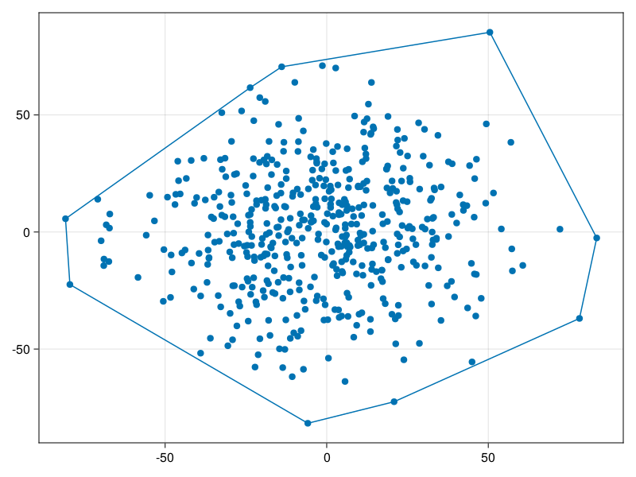

```@meta
CurrentModule = DelaunayTriangulation
```

# Convex Hull

As defined in the data structures section, we have the ability for computing convex hulls. These can be computed outside of the triangulation process, using our implementation of Graham's scan. Here is an example.

```julia
pts = [Tuple(25randn(2)) for _ in 1:500]
ch = convex_hull(pts)
fig = Figure()
ax = Axis(fig[1, 1])
scatter!(ax, pts)
lines!(ax, pts[ch.indices])
```

```@raw html
<figure>
    <br>
</figure>
```