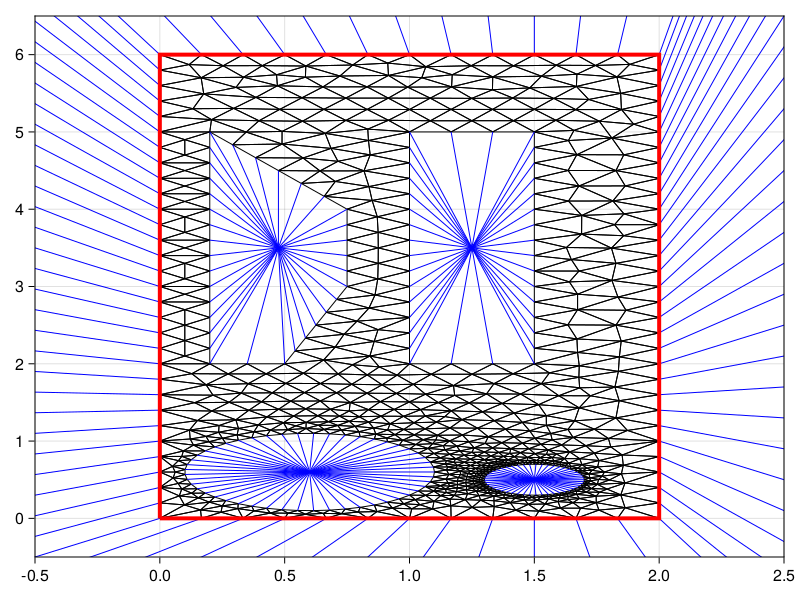

```@meta
CurrentModule = DelaunayTriangulation
```

# Gmsh 

We provide Gmsh support, making it possible to represent more complicated meshes. The discussion that follows assume you have installed Gmsh, and defined a corresponding `GMSH_PATH`. I have used the default,

```julia-repl
julia> GMSH_PATH = "./gmsh-4.11.1-Windows64/gmsh.exe"
```

The methods for generating meshes with Gmsh are shown below.

```@docs 
generate_mesh
```

Let's give some examples. 

## Example I: Contiguous boundary 

Let us mesh a domain with a single non-segmented boundary curve. 

```julia
using DelaunayTriangulation, CairoMakie
a = 4 / 5
t = LinRange(0, 2π, 100)
x = @. a * (2cos(t) + cos(2t))
y = @. a * (2sin(t) - sin(2t))
tri = generate_mesh(x, y, 0.1)
tri2 = generate_mesh(x, y, 1.0)
fig = Figure()
ax = Axis(fig[1, 1], xlabel=L"x", ylabel=L"y", width=300, height=300,
    title=L"(a):$ $ Dense mesh", titlealign=:left)
triplot!(ax, tri)
ax = Axis(fig[1, 2], xlabel=L"x", ylabel=L"y", width=300, height=300,
    title=L"(b):$ $  Coarse mesh", titlealign=:left)
triplot!(ax, tri2)
resize_to_layout!(fig)
```

```@raw html
<figure>
    <br>
</figure>
```

In the figure, the red curve shows the convex hull. We note that we now have information in `tri.boundary_nodes`:

```julia-repl
julia> get_boundary_nodes(tri)
178-element Vector{Int64}:
  1
  2
  3
  4
  ⋮
 97
 98
 99
  1
```

Similarly, `tri.boundary_map` is now populated:

```julia-repl
julia> get_boundary_map(tri)
OrderedDict{Int64, Vector{Int64}} with 1 entry:
  -1 => [1, 2, 3, 4, 5, 6, 100, 7, 101, 8  …  93, 176, 94, 177, 95, 96, 97, 98, 99, 1]
```

We now also have `tri.boundary_edge_map`:

```julia-repl
julia> tri.boundary_edge_map
Dict{Tuple{Int64, Int64}, Tuple{Vector{Int64}, Int64}} with 177 entries:
  (116, 20)  => ([1, 2, 3, 4, 5, 6, 100, 7, 101, 8  …  93, 176, 94, 177, 95, 96, 97, 98, 99, 1], 36)
  (78, 158)  => ([1, 2, 3, 4, 5, 6, 100, 7, 101, 8  …  93, 176, 94, 177, 95, 96, 97, 98, 99, 1], 136)
  (11, 105)  => ([1, 2, 3, 4, 5, 6, 100, 7, 101, 8  …  93, 176, 94, 177, 95, 96, 97, 98, 99, 1], 16)
  (106, 13)  => ([1, 2, 3, 4, 5, 6, 100, 7, 101, 8  …  93, 176, 94, 177, 95, 96, 97, 98, 99, 1], 19)
  (103, 10)  => ([1, 2, 3, 4, 5, 6, 100, 7, 101, 8  …  93, 176, 94, 177, 95, 96, 97, 98, 99, 1], 13)
  (145, 56)  => ([1, 2, 3, 4, 5, 6, 100, 7, 101, 8  …  93, 176, 94, 177, 95, 96, 97, 98, 99, 1], 101)
  (169, 87)  => ([1, 2, 3, 4, 5, 6, 100, 7, 101, 8  …  93, 176, 94, 177, 95, 96, 97, 98, 99, 1], 156)
  (110, 111) => ([1, 2, 3, 4, 5, 6, 100, 7, 101, 8  …  93, 176, 94, 177, 95, 96, 97, 98, 99, 1], 27)
  (128, 42)  => ([1, 2, 3, 4, 5, 6, 100, 7, 101, 8  …  93, 176, 94, 177, 95, 96, 97, 98, 99, 1], 70)
  (43, 130)  => ([1, 2, 3, 4, 5, 6, 100, 7, 101, 8  …  93, 176, 94, 177, 95, 96, 97, 98, 99, 1], 73)
  (30, 31)   => ([1, 2, 3, 4, 5, 6, 100, 7, 101, 8  …  93, 176, 94, 177, 95, 96, 97, 98, 99, 1], 56)
  (156, 77)  => ([1, 2, 3, 4, 5, 6, 100, 7, 101, 8  …  93, 176, 94, 177, 95, 96, 97, 98, 99, 1], 133)
  (3, 4)     => ([1, 2, 3, 4, 5, 6, 100, 7, 101, 8  …  93, 176, 94, 177, 95, 96, 97, 98, 99, 1], 3)
  (112, 113) => ([1, 2, 3, 4, 5, 6, 100, 7, 101, 8  …  93, 176, 94, 177, 95, 96, 97, 98, 99, 1], 30)
  (41, 128)  => ([1, 2, 3, 4, 5, 6, 100, 7, 101, 8  …  93, 176, 94, 177, 95, 96, 97, 98, 99, 1], 69)
  (153, 74)  => ([1, 2, 3, 4, 5, 6, 100, 7, 101, 8  …  93, 176, 94, 177, 95, 96, 97, 98, 99, 1], 127)
  (133, 47)  => ([1, 2, 3, 4, 5, 6, 100, 7, 101, 8  …  93, 176, 94, 177, 95, 96, 97, 98, 99, 1], 80)
  ⋮          => ⋮
```

In this case, each output of `(i, j)` is the `Tuple` `(get_boundary_nodes(tri), k)`. For example,

```julia-repl
julia> u, v = 133, 47;

julia> pos = get_boundary_edge_map(tri, u, v);

julia> segment_nodes = get_boundary_nodes(tri, pos[1]);

julia> get_boundary_nodes(segment_nodes, pos[2]) == u # edges start at the left
true

julia> get_boundary_nodes(segment_nodes, pos[2]+1) == v
true
```

## Example II: Single boundary curve with multiple segments 

Let us now give an example where we still have just a single boundary curve, but we split it into multiple segments. Importantly, each segment must be counter-clockwise and join with the previous segment.

```julia
using DelaunayTriangulation, CairoMakie
# The first segment 
t = LinRange(0, 1 / 4, 25)
x1 = cos.(2π * t)
y1 = sin.(2π * t)
# The second segment 
t = LinRange(0, -3, 25)
x2 = collect(t)
y2 = repeat([1.0], length(t))
# The third segment 
t = LinRange(1, 0, 25)
x3 = -3.0 .+ (1 .- t) .* sin.(t)
y3 = collect(t)
# The fourth segment 
t = LinRange(0, 1, 25)
x4 = collect(-3.0(1 .- t))
y4 = collect(0.98t)
# The fifth segment 
x5 = [0.073914, 0.0797, 0.1522, 0.1522, 0.2, 0.28128, 0.3659, 0.4127, 0.3922, 0.4068, 0.497, 0.631, 0.728, 0.804, 0.888, 1.0]
y5 = [0.8815, 0.8056, 0.80268, 0.73258, 0.6, 0.598, 0.5777, 0.525, 0.4346, 0.3645, 0.3032, 0.2886, 0.2623, 0.1367, 0.08127, 0.0]
# Now combine the vectors 
x = [x1, x2, x3, x4, x5]
y = [y1, y2, y3, y4, y5]
# Mesh 
tri = generate_mesh(x, y, 0.05)
fig = Figure()
ax = Axis(fig[1, 1], xlabel=L"x", ylabel=L"y", width=600, height=300)
triplot!(ax, tri)
colors = [:red, :blue, :orange, :purple, :darkgreen]
bn_map = get_boundary_map(tri)
for (i, segment_index) in enumerate(values(bn_map))
    bn_nodes = get_boundary_nodes(tri, segment_index)
    lines!(ax, get_points(tri)[:, bn_nodes], color=colors[i], linewidth=4)
end
resize_to_layout!(fig)
```

```@raw html
<figure>
    <br>
</figure>
```

An important feature to note for this case is that the index now used to refer to boundaries is no longer constant. In particular, the `n`th segment will map to `-n`, as we can verify using:

```julia-repl
julia> get_boundary_map(tri)
OrderedDict{Int64, Int64} with 5 entries:
  -1 => 1
  -2 => 2
  -3 => 3
  -4 => 4
  -5 => 5
```

This map makes it simple to iterate over all parts of a boundary, as we show in the above code when plotting. The `tri.boundary_edge_map` in this case is:

```julia-repl
julia> get_boundary_edge_map(tri)
Dict{Tuple{Int64, Int64}, Tuple{Int64, Int64}} with 262 entries:
  (118, 8)   => (1, 14)
  (55, 56)   => (3, 10)
  (34, 154)  => (2, 28)
  (213, 214) => (4, 35)
  (223, 224) => (4, 50)
  (143, 29)  => (2, 12)
  (24, 135)  => (1, 47)
  (178, 179) => (2, 65)
  (132, 22)  => (1, 42)
  (46, 178)  => (2, 64)
  (169, 42)  => (2, 51)
  (154, 155) => (2, 29)
  (115, 5)   => (1, 8)
  (43, 172)  => (2, 55)
  (261, 262) => (5, 38)
  (146, 147) => (2, 17)
  (49, 184)  => (3, 1)
  ⋮          => ⋮
```

For example, 

```julia-repl
julia> let pos = get_boundary_edge_map(tri, 115, 5)
       segment_nodes = get_boundary_nodes(tri, pos[1])
       u′ = get_boundary_nodes(segment_nodes, pos[2])
       v′ = get_boundary_nodes(segment_nodes, pos[2]+1)
       u′ == 115 && v′ == 5
       end
true
```

## Example III: Multiple boundaries

Now let us give a more complicated example, meshing a multiply-connected domain. In this case, we provide the outer-most boundary in a counter-clockwise order, while all the inner boundaries are in a clockwise order.

```julia
using DelaunayTriangulation, CairoMakie
x1 = [collect(LinRange(0, 2, 4)),
    collect(LinRange(2, 2, 4)),
    collect(LinRange(2, 0, 4)),
    collect(LinRange(0, 0, 4))]
y1 = [collect(LinRange(0, 0, 4)),
    collect(LinRange(0, 6, 4)),
    collect(LinRange(6, 6, 4)),
    collect(LinRange(6, 0, 4))]
r = 0.5
h = k = 0.6
θ = LinRange(2π, 0, 50)
x2 = [h .+ r .* cos.(θ)]
y2 = [k .+ r .* sin.(θ)]
r = 0.2
h = 1.5
k = 0.5
x3 = [h .+ r .* cos.(θ)]
y3 = [k .+ r .* sin.(θ)]
x4 = reverse(reverse.([collect(LinRange(1, 1.5, 4)),
    collect(LinRange(1.5, 1.5, 4)),
    collect(LinRange(1.5, 1, 4)),
    collect(LinRange(1, 1, 4))]))
y4 = reverse(reverse.([collect(LinRange(2, 2, 4)),
    collect(LinRange(2, 5, 4)),
    collect(LinRange(5, 5, 4)),
    collect(LinRange(5, 2, 4))]))
x5 = [reverse([0.2, 0.5, 0.75, 0.75, 0.2, 0.2])]
y5 = [reverse([2.0, 2.0, 3.0, 4.0, 5.0, 2.0])]
x = [x1, x2, x3, x4, x5]
y = [y1, y2, y3, y4, y5]
tri = generate_mesh(x, y, 0.2)
fig, ax, sc = triplot(tri; show_ghost_edges=true, convex_hull_linestyle=:solid, convex_hull_linewidth=4)
xlims!(ax, -0.5, 2.5)
ylims!(ax, -0.5, 6.5)
```

```@raw html
<figure>
    <br>
</figure>
```

The blue edges show the interpretation of the ghost edges (you can delete via `delete_ghost_triangles!` if you want). For the outer boundary, these edges are pointing away from the interior, collinear with a point in the center, as we can obtain via:

```julia-repl
julia> DelaunayTriangulation.get_representative_point_coordinates(tri, 1)
```

or, alternatively,

```julia-repl 
julia> DelaunayTriangulation.get_representative_point_list(tri)
Dict{Int64, DelaunayTriangulation.RepresentativeCoordinates{Int64, Float64}} with 5 entries:
  5 => RepresentativeCoordinates{Int64, Float64}(0.475, 3.5, 0)
  4 => RepresentativeCoordinates{Int64, Float64}(1.25, 3.5, 0)
  2 => RepresentativeCoordinates{Int64, Float64}(0.6, 0.6, 0)
  3 => RepresentativeCoordinates{Int64, Float64}(1.5, 0.5, 0)
  1 => RepresentativeCoordinates{Int64, Float64}(1.5, 1.5, 0)
```

The keys are the indices for the boundary curve. These coordinates are visual centers, obtained via the pole of inaccessibility function; see the sidebar. For the inner boundaries, the ghost edges are no longer infinite and so they connect directly with these representative coordinates.

To access more of the boundary information, we could first consider `boundary_nodes`:

```julia-repl
julia> get_boundary_nodes(tri)
5-element Vector{Vector{Vector{Int64}}}:
 [[1, 128, 129, 130, 2, 131, 132, 133, 3, 134, 135, 136, 4], [4, 137, 138, 139, 140, 141, 142, 143, 144, 145  …  155, 156, 157, 158, 159, 160, 161, 162, 163, 7], [7, 164, 165, 166, 8, 167, 168, 169, 9, 170, 171, 172, 10], [10, 173, 174, 175, 176, 177, 178, 179, 180, 181  …  191, 192, 193, 194, 195, 196, 197, 198, 199, 1]]
 [[13, 14, 15, 16, 17, 18, 19, 20, 21, 22  …  53, 54, 55, 56, 57, 58, 59, 60, 61, 13]]
 [[62, 63, 64, 65, 66, 67, 68, 69, 70, 71  …  102, 103, 104, 105, 106, 107, 108, 109, 110, 62]]
 [[111, 200, 201, 202, 203, 112, 204, 205, 206, 207, 113, 208, 209, 210, 211, 114], [114, 115, 116, 117], [117, 212, 213, 214, 215, 118, 216, 217, 218, 219, 119, 220, 221, 222, 223, 120], [120, 121, 122, 111]]  
 [[123, 224, 225, 226, 227, 228, 229, 230, 231, 232  …  246, 126, 247, 248, 249, 250, 251, 127, 252, 123]]
```

This is simply a vector of curves, with each curve storing its segments. This vector itself does not tell us what boundary index corresponds to what segment of what curve, and this could be obtained from the boundary map:

```julia-repl
julia> get_boundary_map(tri)
OrderedDict{Int64, Tuple{Int64, Int64}} with 11 entries:
  -1  => (1, 1)
  -2  => (1, 2)
  -3  => (1, 3)
  -4  => (1, 4)
  -5  => (2, 1)
  -6  => (3, 1)
  -7  => (4, 1)
  -8  => (4, 2)
  -9  => (4, 3)
  -10 => (4, 4)
  -11 => (5, 1)
```

So, for example, the boundary index `-8` comes from the second segment of the fourth curve. As before, this boundary map makes it simple to iterate over each segment as follows:

```julia
bn_map = get_boundary_map(tri)
for segment_index in values(bn_map)
    bn_nodes = get_boundary_nodes(tri, segment_index)
    nedges = num_boundary_edges(bn_nodes) # Note that nedges = length(bn_nodes) - 1
    for edge_idx in 1:nedges 
        node = get_boundary_node(bn_nodes, edge_idx)
        ...
    end
end
```

The form above is generic, and ignores the last part of each segment (since it is duplicated for the next segment). Of course, a version like

```julia
bn_map = get_boundary_map(tri)
for segment_index in values(bn_map)
    bn_nodes = get_boundary_nodes(tri, segment_index)
    for i in bn_nodes
        node = get_boundary_node(bn_nodes, i)
        ...
    end
end
```

(which includes the last part of each segment) could be used. It is up to you based on your interface how you prefer to write this. Notice also that in the previous example we used a similar style, using `get_boundary_nodes(tri, segment_index)` also. The function `get_boundary_nodes` can be used with either single integers or `Tuple`s, making it simple to iterate with this exact pattern whether we have a contiguous boundary curve, a segmented boundary curve, or multiple boundaries. 

Another feature to note is `tri.boundary_index_ranges`, which will tell us what other boundary indices belong to a curve given a known boundary index for that curve. This can be useful if we want to rotate around a boundary curve based on a given boundary index (see e.g. how it is used in the `get_left_boundary_node` and `get_right_boundary_node` functions). This field is a major part of making point location work in these inner boundaries, making `get_adjacent` work properly in this case (see e.g. the code in `_safe_get_adjacent`).

```julia-repl
julia> get_boundary_index_ranges(tri)
OrderedDict{Int64, UnitRange{Int64}} with 11 entries:
  -1  => -4:-1
  -2  => -4:-1
  -3  => -4:-1
  -4  => -4:-1
  -5  => -5:-5
  -6  => -6:-6
  -7  => -10:-7
  -8  => -10:-7
  -9  => -10:-7
  -10 => -10:-7
  -11 => -11:-11
```

So, for example, we see tha the boundary index `-3` belongs to a curve that also has boundary indices `-1`, `-2`, and `-4`. If we wanted to go from a boundary index to the index for the curve, this is what the boundary map is also for:

```julia-repl
julia> DelaunayTriangulation.get_curve_index(tri, -3)
1
```

The last feature to show is the new `tri.boundary_edge_map` for this case, given by

```julia-repl
julia> get_boundary_edge_map(tri)
Dict{Tuple{Int64, Int64}, Tuple{Tuple{Int64, Int64}, Int64}} with 252 entries:
  (55, 56)   => ((2, 1), 43)
  (130, 2)   => ((1, 1), 4)
  (92, 93)   => ((3, 1), 31)
  (213, 214) => ((4, 3), 3)
  (14, 15)   => ((2, 1), 2)
  (172, 10)  => ((1, 3), 12)
  (203, 112) => ((4, 1), 5)
  (178, 179) => ((1, 4), 7)
  (121, 122) => ((4, 4), 2)
  (151, 152) => ((1, 2), 17)
  (26, 27)   => ((2, 1), 14)
  (171, 172) => ((1, 3), 11)
  (88, 89)   => ((3, 1), 27)
  (132, 133) => ((1, 1), 7)
  (133, 3)   => ((1, 1), 8)
  (146, 147) => ((1, 2), 12)
  (46, 47)   => ((2, 1), 34)
  ⋮          => ⋮
```

As before, `(u, v) = (get_boundary_nodes(segment_nodes, pos[2]), get_boundary_nodes(segment_nodes, pos[2]+1)`, where `segment_nodes = get_boundary_nodes(tri, pos[1])` and `pos = get_boundary_edge_map(tri, u, v)`. This pattern is true for any form of boundary nodes, in fact.