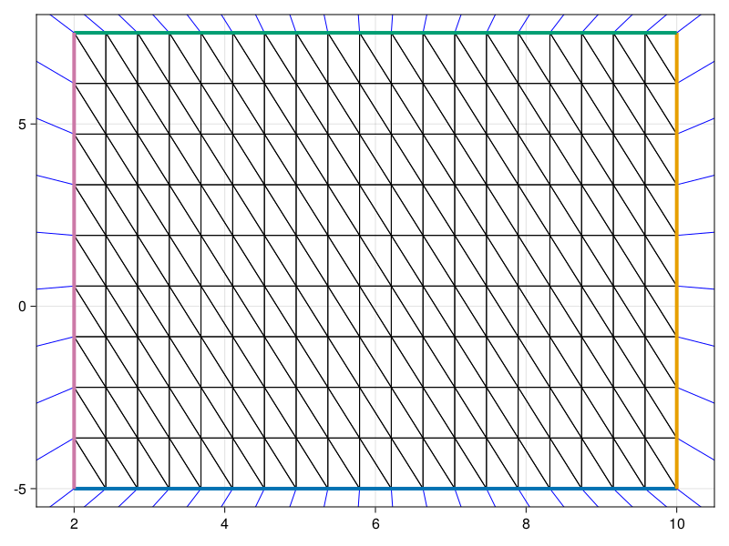
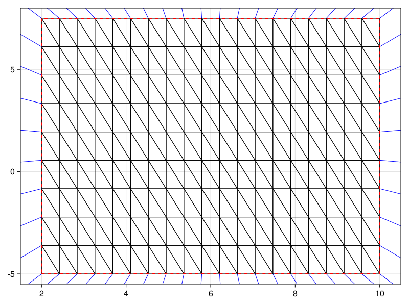

```@meta
CurrentModule = DelaunayTriangulation
```


# Lattice Triangulations 

We provide a method for triangulation a lattice on some grid $[a, b] \times [c, d]$ with $n_x \times n_y$ points. The docstring for this method is given below.

```@docs 
triangulate_rectangle
```

The `single_boundary` argument is useful if you want to, for example, have a boundary condition for the entire boundary or for each side of the boundary separately. 

An example of the single boundary case is below.

```julia
a, b, c, d = 2.0, 10.0, -5.0, 7.5
nx = 20
ny = 10
tri = DT.triangulate_rectangle(a, b, c, d, nx, ny)
fig, ax, sc = triplot(tri; show_ghost_edges=true)
xlims!(ax, a - 0.5, b + 0.5)
ylims!(ax, c - 0.5, d + 0.5)
lines!(ax, tri.points[:, get_boundary_nodes(tri, 1)]; linewidth=4)
lines!(ax, tri.points[:, get_boundary_nodes(tri, 2)]; linewidth=4)
lines!(ax, tri.points[:, get_boundary_nodes(tri, 3)]; linewidth=4)
lines!(ax, tri.points[:, get_boundary_nodes(tri, 4)]; linewidth=4)
```

```@raw html
<figure>
    <br>
</figure>
```

The blue edges show the interpretation of the ghost edges.

An example of the four boundary case is below.

```julia
tri = DT.triangulate_rectangle(a, b, c, d, nx, ny; single_boundary=true)
fig, ax, sc = triplot(tri; show_ghost_edges=true)
xlims!(ax, a - 0.5, b + 0.5)
ylims!(ax, c - 0.5, d + 0.5)
```

```@raw html
<figure>
    <br>
</figure>
```