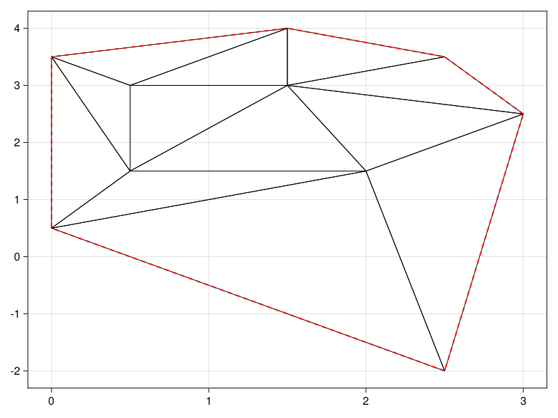

```@meta
CurrentModule = DelaunayTriangulation
```


# Unconstrained Triangulations 

It is simple to construct unconstrained triangulations. The method for this is through the `triangulate` function, shown below.

```@docs 
triangulate 
```

In the code below, we give an example, and show how we can plot the result.

```julia
using DelaunayTriangulation, CairoMakie 
a = [1.5, 4.0]
b = [0.0, 3.5]
c = [2.0, 1.5]
d = [3.0, 2.5]
e = [2.5, 3.5]
f = [0.5, 3.0]
g = [2.5, -2.0]
h = [0.5, 1.5]
i = [0.0, 0.5]
j = [1.5, 3.0]
pts = [a, b, c, d, e, f, g, h, i, j]
tri = triangulate(pts)
fig, ax, sc = triplot(tri)
```

```@raw html
<figure>
    <br>
</figure>
```

This object `tri` is a `Triangulation`.
```julia-repl
julia> tri
Delaunay Triangulation.
    Constrained: false
    Has ghost triangles: false
    Number of points: 10
    Number of triangles: 12
    Number of edges: 27
```

As we describe in more detail in the data structures section in the sidebar, `tri` has several fields:
```julia-repl 
julia> propertynames(tri)
(:points, :triangles, :adjacent, :adjacent2vertex, :graph, :boundary_nodes, :boundary_map, :boundary_index_ranges, :constrained_edges, :convex_hull)
```
We explain each field below.

- `tri.points`: This stores `pts`.

- `tri.triangles`: This stores all the triangles. In this case,

```julia-repl
julia> get_triangles(tri)
Set{Tuple{Int64, Int64, Int64}} with 12 elements:
  (10, 5, 1)
  (9, 7, 3)
  (2, 6, 1)
  (3, 10, 8)
  (10, 4, 5)
  (9, 3, 8)
  (3, 4, 10)
  (8, 6, 2)
  (9, 8, 2)
  (10, 1, 6)
  (8, 10, 6)
  (3, 7, 4)
```
More generally, you can iterate over these triangles via `each_triangle(tri)`. For example, the area of the triangulation could be computed as follows:

```julia
triangle_area(p, q, r) = 0.5 * (p[1] * q[2] + q[1] * r[2] + r[1] * p[2] - p[1] * r[2] - r[1] * q[2] - q[1] * p[2])
A = 0.0
for T in each_triangle(tri)
    i, j, k = indices(T)
    p, q, r = get_point(tri, i, j, k)
    A += triangle_area(p, q, r)
end 
```

- `tri.adjacent`: This stores the adjacency relationships of the triangulation, mapping edges `(u, v)` to a vertex `w` so that `(u, v, w)` is a positively oriented triangle in `tri`. In this case, we have 

```julia-repl
julia> get_adjacent(tri)
Adjacent{Int64, Tuple{Int64, Int64}}, with map:
DataStructures.DefaultDict{Tuple{Int64, Int64}, Int64, Int64} with 43 entries:
  (9, 3)  => 8
  (8, 9)  => 3
  (4, 7)  => -1
  (2, 1)  => -1
  (10, 1) => 6
  (2, 8)  => 6
  (10, 8) => 3
  (3, 9)  => 7
  (4, 5)  => 10
  (8, 3)  => 10
  (9, 8)  => 2
  ⋮       => ⋮
```

This object is iterable, allowing for you to do e.g.

```julia
for (uv, w) in get_adjacent(tri)
    u = initial(uv)
    v = terminal(uv)
    ...
end
```

- `tri.adjacent2vertex`: This is a map that returns, given an index `i`, all other edges `(j, k)` such that `(i, j, k)` is a positively oriented triangle in the triangulation. In this case, we have 

```julia-repl
julia> get_adjacent2vertex(tri)
Adjacent{Int64, Set{Tuple{Int64, Int64}}, Tuple{Int64, Int64}}, with map:
Dict{Int64, Set{Tuple{Int64, Int64}}} with 11 entries:
  5  => Set([(10, 4), (1, 10)])
  8  => Set([(9, 3), (2, 9), (6, 2), (3, 10), (10, 6)])
  1  => Set([(6, 10), (10, 5), (2, 6)])
  6  => Set([(1, 2), (2, 8), (10, 1), (8, 10)])
  -1 => Set([(7, 9), (4, 7), (2, 1), (9, 2), (5, 4), (1, 5)])
  9  => Set([(7, 3), (3, 8), (8, 2)])
  3  => Set([(7, 4), (4, 10), (10, 8), (8, 9), (9, 7)])
  7  => Set([(3, 9), (4, 3)])
  4  => Set([(5, 10), (3, 7), (10, 3)])
  2  => Set([(8, 6), (9, 8), (6, 1)])
  10 => Set([(4, 5), (6, 8), (8, 3), (5, 1), (1, 6), (3, 4)])
```

This object is iterable, allowing for you to do e.g. 

```julia
for (w, S) in get_adjacent2vertex(w)
    for (u, v) in S 
        ...
    end
end 
```

- `tri.graph`: This is a graph that returns, given an index `i`, all other indices `j` such that `(i, j)` is an edge in the triangulation. In this case, we have 

```julia-repl 
julia> get_graph(tri)
Graph
    Number of edges: 27
    Number of vertices: 11

julia> get_edges(tri)
Set{Tuple{Int64, Int64}} with 27 elements:
  (2, 9)
  (4, 5)
  (1, 2)
  (6, 8)
  (6, 10)
  (3, 7)
  (-1, 2)
  (4, 7)
  (3, 4)
  (1, 5)
  (-1, 9)
  (4, 10)
  (2, 8)
  (-1, 5)
  (1, 6)
  (3, 9)
  (7, 9)
  ⋮

julia> get_neighbours(tri)
Dict{Int64, Set{Int64}} with 11 entries:
  5  => Set([4, -1, 10, 1])
  8  => Set([6, 2, 10, 9, 3])
  1  => Set([5, 6, 2, 10, -1])
  6  => Set([2, 10, 8, 1])
  -1 => Set([5, 4, 7, 2, 9, 1])
  9  => Set([7, 2, -1, 8, 3])
  3  => Set([4, 7, 10, 9, 8])
  7  => Set([4, -1, 9, 3])
  4  => Set([5, 7, -1, 10, 3])
  2  => Set([6, -1, 9, 8, 1])
  10 => Set([5, 4, 6, 8, 3, 1])
```

- `tri.boundary_nodes`: This is a list of all fixed boundary nodes in the triangulation. In our case, we have none. See the Gmsh section for an example. The actual nodes on the boundary in this case can be obtained via `tri.convex_hull`.

- `tri.boundary_map`: This would be a list mapping boundary indices to all the fixed boundary nodes in `tri.boundary_nodes` corresponding to that index. This map is empty in this case as we have no fixed boundary nodes,, but see the Gmsh section for an example.

- `tri.boundary_index_ranges`: This is be a list mapping indices of boundary curves to all boundary indices belonging to that curve. In this case, we have 

```julia-repl 
julia> get_boundary_index_ranges(tri)
OrderedCollections.OrderedDict{Int64, UnitRange{Int64}} with 1 entry:
  -1 => -1:-1
```

This tells us that whenever we see a `-1` as a vertex, we have a ghost vertex corresponding to the outer curve, so e.g. if `get_adjacent(tri, u, v) == -1`, then `(u, v)` is an edge on the boundary. A better example is in the Gmsh section.

- `tri.constrained_edges`: This would be the collection of constrained edges if we had any.

- `tri.convex_hull`: This is the `ConvexHull` of `tri.points`. In this case, we have

```julia-repl
julia> get_convex_hull(tri)
Convex hull.
    Indices:
7-element Vector{Int64}:
 7
 4
 5
 1
 2
 9
 7
```