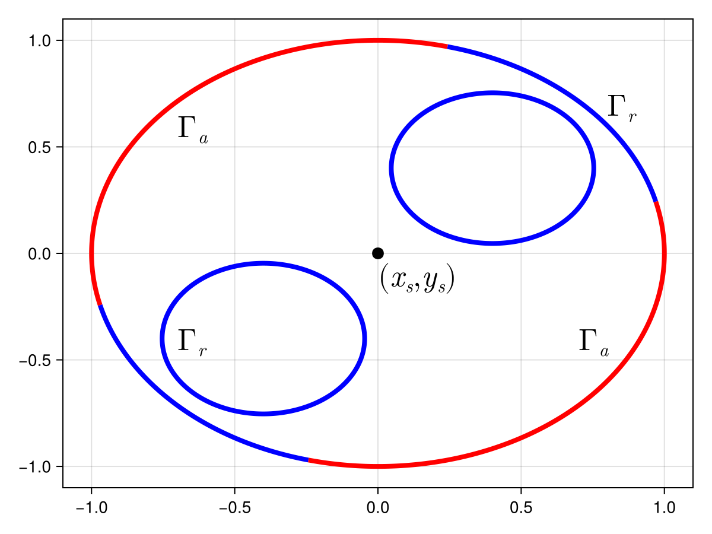

# Summary 

Given a set of points $\mathcal P$, edges $\mathcal E$, and piecewise linear boundaries $\mathcal B$ together defining some domain $\Omega$, a _Delaunay triangulation_ is a subdivision of this domain into triangles. The vertices of the triangles come from $\mathcal P$, and each of the edges in $\mathcal E$ and $\mathcal B$ is present as an edge of some triangle [@cheng2013delaunay; @aurenhammer2013voronoi]. A related geometric structure is the _Voronoi tessellation_ that partitions the plane into convex polygons for each $p \in \mathcal P$ such that, for a given polygon, each point in that polygon is closer to the associated polygon's point than to any other $q \in \mathcal P$ [@cheng2013delaunay; @aurenhammer2013voronoi].

DelaunayTriangulation.jl is a feature-rich Julia [@bezanson2017julia] package for computing Delaunay triangulations and Voronoi tessellations. The package, amongst many other features, supports constrained triangulations, mesh refinement, centroidal Voronoi tessellations, and dynamic updates. Thanks to the speed and genericity of Julia, the package is both performant and robust---making use of ExactPredicates.jl for computing predicates with exact arithmetic [@lairez2024exact]---while still allowing for generic representations of geometric primitives.

# Statement of Need 

Delaunay triangulations and Voronoi tessellations have applications in a myriad of fields. Delaunay triangulations have been used for point location [@mucke1999fast], solving differential equations [@golias1997delaunay; @ju2006adaptive], route planning [@chen2010enhanced; @yan2008path], etc. Voronoi tessellations are typically useful when there is some notion of _influence_ associated with a point, and have been applied to problems such as geospatial interpolation [@bobach2009natural], image processing [@du1999centroidal], and cell biology [@hermann2008delaunay; @wang2024calibration].

Several software packages with support for computing Delaunay triangulations and Voronoi tessellations in two dimensions already exist, such as _Triangle_ [@shewchuk1996triangle], _MATLAB_ [@MATLAB], _SciPy_ [@SciPy], _CGAL_ [@CGAL], and _Gmsh_ [@GMSH]. DelaunayTriangulation.jl is the most feature-rich of these and benefits from the high-performance of Julia to efficiently support many operations. Julia's multiple dispatch [@bezanson2017julia] 
is leveraged to allow for complete customisation in how a user wishes to represent geometric primitives such as points and domain boundaries, a useful feature for allowing users to represent primitives in a way that suits their application without needing to sacrfice performance. The [documentation](https://juliageometry.github.io/DelaunayTriangulation.jl/stable/) lists many more features, including its ability a wide range of domains, even those that are disjoint and with holes. 

DelaunayTriangulation.jl has already seen use in several areas. DelaunayTriangulation.jl was used for mesh generation in [@vandenheuvel2023computational] and is used for the `tricontourf`, `triplot`, and `voronoiplot` routines inside Makie.jl [@danisch2021makie]. The packages [FiniteVolumeMethod.jl](https://github.com/SciML/FiniteVolumeMethod.jl) [@vandenheuvel2024finite] and [NaturalNeighbours.jl](https://github.com/DanielVandH/NaturalNeighbours.jl) [@vandenheuvel2024natural] are also built directly on top of DelaunayTriangulation.jl. The design of boundaries in DelaunayTriangulation.jl has been motivated especially for the efficient representation of boundary conditions along different parts of a boundary for solving differential equations, and this is heavily utilised by FiniteVolumeMethod.jl.  

# Examples

We give two examples of how the package can be used. Many more examples are given in the [documentation](https://juliageometry.github.io/DelaunayTriangulation.jl/stable/), including [tutorials](https://juliageometry.github.io/DelaunayTriangulation.jl/stable/tutorials/overview/) and [fully detailed applications](https://juliageometry.github.io/DelaunayTriangulation.jl/stable/applications/overview/) such as cell simulations. To fully demonstrate the utility of the package, our examples follow realistic applications. We omit code used for plotting with Makie.jl [@danisch2021makie] in the examples below for space reasons. The complete code is available [here](https://github.com/JuliaGeometry/DelaunayTriangulation.jl/blob/paper/paper/paper.jl).

For our first example, we consider a domain motivated by mean exit time. In particular, consider the problem
$$
\begin{array}{rcll}
D\nabla^2 T(x, y) & = & -1 & (x, y) \in \Omega, \\
T(x, y) & = & 0 & (x, y) \in \Gamma_a, \\
T(x, y) & = & 0 & (x, y) = (x_s, y_s), \\
\nabla T(x, y) \cdot \hat{\boldsymbol n}(x, y) & = & 0 & (x, y) \in \Gamma_r. 
\end{array}
$$
Here, $T(x, y)$ denotes the mean exit time of a particle exiting $\Omega$ with diffusivity $D$ starting at $(x, y)$ [@redner2001guide; @carr2022mean], $\hat{\boldsymbol n}(x, y)$ is the unit normal vector field on $\Gamma_r$, $(x_s, y_s) = (0, 0)$, and the domain $\Omega$ with boundary $\partial\Omega = \Gamma_a \cup \Gamma_r$ is shown in \autoref{fig:0}. This setup defines a mean exit time where the particle can only exit through $\Gamma_a$ or through the sink $(x_s, y_s)$, and it gets reflected off of $\Gamma_r$.

{ width = 20% }

The code to generate a mesh of the domain in Figure \ref{fig0} is given below. We use curves to define the boundary so that curve-bounded refinement can be applied [@gosselin2009delaunay]. The resulting mesh is shown in \autoref{fig:1}, together with a solution of the mean exit time problem with $D = 6.25 \times 10^{-4}$; FiniteVolumeMethod.jl [@vandenheuvel2024finite] is used to solve this problem, and the code for this can be found [here](https://github.com/JuliaGeometry/DelaunayTriangulation.jl/blob/paper/paper/paper.jl).

```julia
# The outer circle
θ = 5π / 64
cs = θ -> (cos(θ), sin(θ))
p1, q1 = cs(-π / 2 - θ), cs(θ) # Absorbing 
p2, q2 = q1, cs(π / 2 - θ)     # Reflecting 
p3, q3 = q2, cs(π + θ)         # Absorbing 
p4, q4 = q3, p1                # Reflecting
c0 = (0.0, 0.0)
C01 = CircularArc(p1, q1, c0) # first, last, center
C02 = CircularArc(p2, q2, c0)
C03 = CircularArc(p3, q3, c0)
C04 = CircularArc(p4, q4, c0)
C0 = [[C01], [C02], [C03], [C04]]
# Inner circles
c1, p5 = (-0.4, -0.4), (-0.65, -0.65)
c2, p6 = (0.4, 0.4), (0.65, 0.65)
C1 = CircularArc(p5, p5, c1, positive=false) # Reflecting
C2 = CircularArc(p6, p6, c2, positive=false) # Reflecting
# Triangulate and refine
sink = (0.0, 0.0)
tri = triangulate([sink], boundary_nodes=[C0, [[C1]], [[C2]]])
refine!(tri; max_area=1e-3get_area(tri))
```

![(a) The generated mesh using DelaunayTriangulation.jl for the mean exit time domain. The different parts of the boundary are shown with different coloured dots. (b) The solution to the mean exit time problem using the mesh from (a) together with FiniteVolumeMethod.jl[@vandenheuvel2024finite].\label{fig:1}](figure1.png)

We now give an example using Voronoi tessellations. Our example is motivated from Lloyd's algorithm for $k$-means clustering [@du1999centroidal]. We generate $k$ random points and compute their centroidal Voronoi tessellation. We then generate data and label them according to which Voronoi cell they belong to.[^1] The code is given below, and the resulting plot is given in \autoref{fig:2}.

[^1]: This example is somewhat contrived. Our procedure only corresponds to $k$-means clustering when the data set is dense [@kanugo2002efficient; @du1999centroidal]. To exactly obtain $k$-means clustering, the density function used for computing the centroids would need to be adjusted. See Section 2.3 of [@du1999centroidal] for more details.

```julia
using Random
Random.seed!(123)
k = 7
clusters = [(rand(), rand()) for _ in 1:k]
# Assume data live in [0, 1]²
push!(clusters, (0.0, 0.0), (1.0, 0.0), (0.0, 1.0), (1.0, 1.0))
# Tessellate and smooth 
tri = triangulate(clusters)
vor = voronoi(tri, clip=true) # clips to [0, 1]²
cvor = centroidal_smooth(vor)
# Generate data and assign 
data = rand(2, 2500)
label = p -> get_nearest_neighbour(cvor, p)
labels = label.(eachcol(data))
```


# Extensions

There are still several features that are intended to eventually be implemented, some of these being:

1. Weighted triangulations and Voronoi treemaps, using the algorithms described in [@cheng2013delaunay; @arlind2012computing].
2. Support for maximum angle constraints and generalised Steiner points, using algorithms and ideas described in [@hale2009quality; hale2009computing].
3. Clipped Voronoi tessellations to arbitrary boundaries, possibly using the VoroCrust algorithm [@ahmed2020vorocrust].
4. Centroidal tessellations with inhomogeneous mass densities, as described in [@du1999centroidal].
5. Inserting curves into an existing triangulation [@gosselin2009delaunay; @zaide2014inserting].
6. Delaunay repair algorithms for retriangulating perturbed point sets, using ideas from [@shewchuk2005star; @yuanfeng2010fast]. 

There is no intention to support three-dimensional geometries within DelaunayTriangulation.jl. For this, the best option is TetGen [@hang2015tetgen].

# References